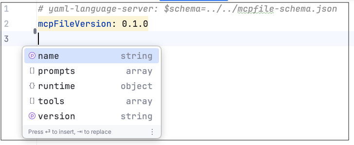

# gen-mcp: Zero-Code MCP Server Generation

> Transform any API into an MCP server in seconds, not hours


[](LICENSE)
[](https://modelcontextprotocol.io/)

**⚠️ Early Preview**: This is a research project in active development. APIs and features may change.

gen-mcp eliminates the complexity of building Model Context Protocol (MCP) servers. Instead of writing boilerplate code and learning protocol internals, simply describe your tools in a configuration file—gen-mcp handles the rest.

**Perfect for:**
- 🔌 **API Developers** - Expose existing REST APIs to AI assistants instantly
- 🤖 **AI Engineers** - Connect LLMs to external tools without custom server code  
- 🛠️ **DevOps Teams** - Integrate legacy systems with modern AI workflows


## ✨ Key Features

- **🚀 Zero-Code Server Generation** - Create MCP servers from simple YAML configs
- **📡 OpenAPI Auto-Conversion** - Transform existing OpenAPI specs into MCP servers instantly
- **🔄 Real-Time Tool Exposure** - HTTP endpoints become callable AI tools automatically
- **🛡️ Built-in Validation** - Schema validation and type safety out of the box
- **🔐 Security Out of the Box** - TLS encryption and OAuth/OIDC authentication built-in
- **⚡ Background Processing** - Detached server mode with process management
- **🔧 Flexible Configuration** - Fine-tune which endpoints to expose and how they behave

## 🚀 Quick Start

### 1. Install gen-mcp

**Option A: Download Pre-built Binary**
```bash
# Download from GitHub releases
# Visit: https://github.com/genmcp/gen-mcp/releases
# Or using curl (replace with latest version):
curl -L https://github.com/genmcp/gen-mcp/releases/latest/download/genmcp-linux-amd64 -o genmcp
chmod +x genmcp
sudo mv genmcp /usr/local/bin
```

**Option B: Build from Source**
```bash
# Clone and build
git clone https://github.com/genmcp/gen-mcp.git
cd gen-mcp

# Build CLI
make build-cli

# Add to PATH (recommended)
sudo mv genmcp /usr/local/bin
```

### 2. Choose Your Own Adventure

**Option A: Convert Existing API**
```bash
genmcp convert https://api.example.com/openapi.json
genmcp run
```

**Option B: Create Custom Tools**
```bash
# Create mcpfile.yaml with your tools (see documentation)
genmcp run
```

### 3. See It In Action
- [📹 HTTP Conversion Demo](https://youtu.be/boMyFzpgJoA) 
- [📹 Ollama Integration Demo](https://youtu.be/yqJV9rNwfg8)

## 📖 Documentation

- **[MCP File Format Guide](./docs/mcp_file_format.md)** - Learn to write custom tool configurations
- **[Examples Directory](./examples/)** - Real-world integration examples

## 💻 Usage

### Core Commands

| Command | Description | Example |
|---------|-------------|---------|
| `run` | Start MCP server | `genmcp run -f myapi.yaml` |
| `stop` | Stop running server | `genmcp stop` |
| `convert` | OpenAPI → MCP conversion | `genmcp convert api-spec.json` |
| `build` | Build container image from mcpfile | `genmcp build -f myapi.yaml --tag myapi:latest` |
| `version` | Display version information | `genmcp version` |

### Starting Your Server

```bash
# Run in foreground (development)
genmcp run -f /path/to/mcpfile.yaml

# Run in background
genmcp run -d

# Auto-detect mcpfile.yaml in current directory
genmcp run
```

### Converting Existing APIs

```bash
# From local OpenAPI file
genmcp convert ./api-spec.json

# From remote OpenAPI URL
genmcp convert https://api.example.com/openapi.json -o custom-name.yaml

# Petstore example
genmcp convert https://petstore.swagger.io/v2/swagger.json
```

### Converting CLI (Experimental)

Instead of manually writing an MCP file for a CLI, you can use an LLM to generate a genmcp-compatible mcpfile.yaml.

```bash
# Set OpenAI endpoint configurations
export MODEL_BASE_URL='https://HOST:PORT/v1' # OpenAI Base URL (v1 endpoint)
export MODEL_KEY='' # OpenAI Access Token
export MODEL_NAME=''  # OpenAI Model Name

# Run gen-mcp convert-cli to generate mcpfile.yaml
MODEL_BASE_URL=$MODEL_BASE_URL MODEL_KEY=$MODEL_KEY MODEL_NAME=$MODEL_NAME genmcp convert-cli "podman images"

# Start mcpserver with generated mcpfile.yaml 
genmcp run
```


### Managing Running Servers

```bash
# Stop server (uses mcpfile.yaml to find process)
genmcp stop

# Stop specific server
genmcp stop -f /path/to/mcpfile.yaml
```

## 💡 Authoring `mcpfile.yaml` with auto complete

To improve the development experience and prevent configuration errors, this project includes a **JSON schema** for the `mcpfile.yaml` format. This schema enables validation, autocompletion, and inline documentation in compatible code editors like Visual Studio Code, helping you write valid configuration files faster.

To make use of the schema, add a `yaml-language-server` comment at the top of your `mcpfile.yaml`:

```yaml
# yaml-language-server: $schema=https://raw.githubusercontent.com/genmcp/gen-mcp/refs/heads/main/specs/mcpfile-schema.json
schemaVersion: 0.2.0
name: ...
```

Intellij IDEs [support](https://www.jetbrains.com/help/idea/json.html#ws_json_schema_add_custom) JSON schema validation natively.

VS Code requires the installation of the [YAML extension by Red Hat](https://marketplace.visualstudio.com/items?itemName=redhat.vscode-yaml).



## 📚 Examples & Tutorials

### 🤖 Ollama Integration
**[📹 Watch Demo](https://youtu.be/yqJV9rNwfg8)** | **[View Code](./examples/ollama/)**

Connect local language models to MCP Clients with gen-mcp in two ways: by wrapping the Ollama CLI, and by wrapping the Ollama http endpoints.

**Features:**
- ✅ HTTP REST API integration
- ✅ CLI command execution  
- ✅ Model management tools

### 🔗 HTTP API Conversion
**[📹 Watch Demo](https://youtu.be/boMyFzpgJoA)** | **[View Code](./examples/http-conversion/)**

Transform any REST API into MCP tools automatically:

```bash
# 1. Convert OpenAPI spec
genmcp convert http://localhost:9090/openapi.json

# 2. Run the generated MCP server
genmcp run
```

**Demonstrates:**
- 🔄 Automatic OpenAPI → MCP conversion
- 🛠️ Path parameter substitution (`/features/{id}`)
- 📊 Schema validation and type safety
- 🎯 Selective endpoint exposure

### 🔌 gRPC Service Integration
**[View Demo Repository](https://github.com/genmcp/grpc-demo/)**

Expose existing gRPC services to LLMs without modifying service code:

**Architecture:**
- Uses [gRPC-Gateway](https://github.com/grpc-ecosystem/grpc-gateway) to create an HTTP/JSON proxy
- Exposes the HTTP proxy as MCP tools via gen-mcp
- Works with any gRPC service using only `.proto` definitions

**Perfect for:**
- 🏢 Integrating legacy gRPC services with AI workflows
- 🔄 Bridging binary gRPC with JSON-based LLM interfaces
- 🚀 Getting started before native gRPC support arrives

**Note:** This is a workaround pattern until gen-mcp adds native gRPC support.

---

## 🤝 Contributing

We welcome contributions! This is an early-stage research project with lots of room for improvement.

### Development Setup
```bash
git clone https://github.com/genmcp/gen-mcp.git
cd gen-mcp
go test ./...

# Build local binary
make build-cli
```

## 📄 License

Apache 2.0 License - see [LICENSE](LICENSE) file for details.

## 🔗 Links

- **[Model Context Protocol](https://modelcontextprotocol.io/)** - Official MCP documentation
- **[MCP File Format](./docs/mcp_file_format.md)** - gen-mcp configuration reference
- **[Examples](./examples/)** - Real-world integration examples
- **[gRPC Integration Demo](https://github.com/genmcp/grpc-demo/)** - Pattern for exposing gRPC services via HTTP proxy

---

<div align="center">
  <strong>Made with ❤️ for the AI development community</strong>
</div>
