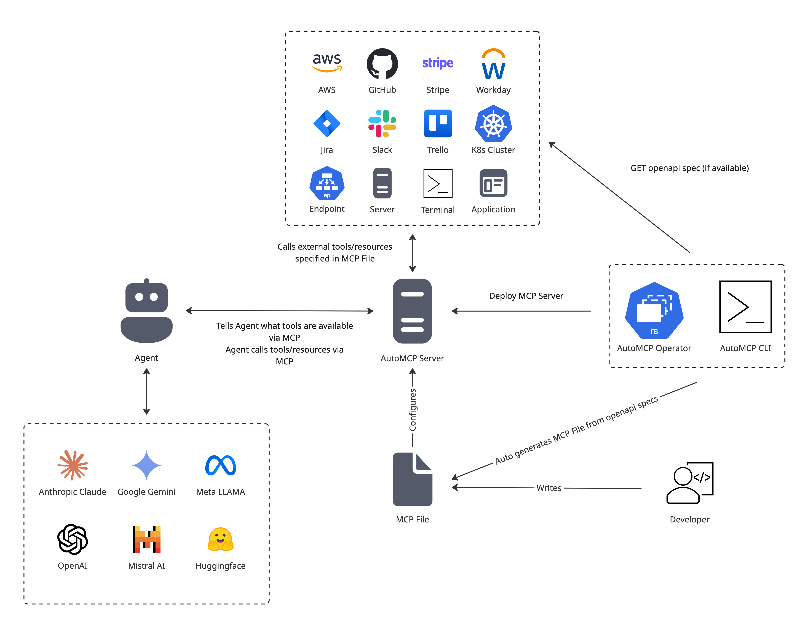

# AutoMCP: Effortless MCP Server Creation

The Model Context Protocol (MCP) provides a standardized way to expose tools, prompts,
and resources to LLMs, powering the development of complex agents and standardizing
how developers provide LLMs access to external systems and APIs.

However, the process of building MCP servers involves lots of manual work to wrap existing
APIs into the protocol, and requires learning the protocol and associated SDK.

AutoMCP automates this process. Instead of requiring you to write an MCP server to wrap your
APIs or other systems, it only requires you to describe what tools it should expose as well
as how to call them. AutoMCP handles everything else for the MCP server for you, freeing up
developers to focus on how their APIs and tools are built and deployed, rather than on MCP
server implementation details.

Whether you are a developer aiming to expose your work through MCP, or a consumer looking to
interact with existing APIs through an MCP server that hasn't been built yet, AutoMCP is your
solution.

 

## Features

1. **Automatic MCP Server Creation**: Create fully functional MCP servers diretly from a
simple MCP file
2. **[Coming soon] OpenAPI to MCP File Conversion**: Effortlessly create MCP files directly
from your existing OpenAPI docs.

## Documentation

To learn how to write your own MCP Files, please read [the MCP file format docs](./docs/mcp_file_format.md)
